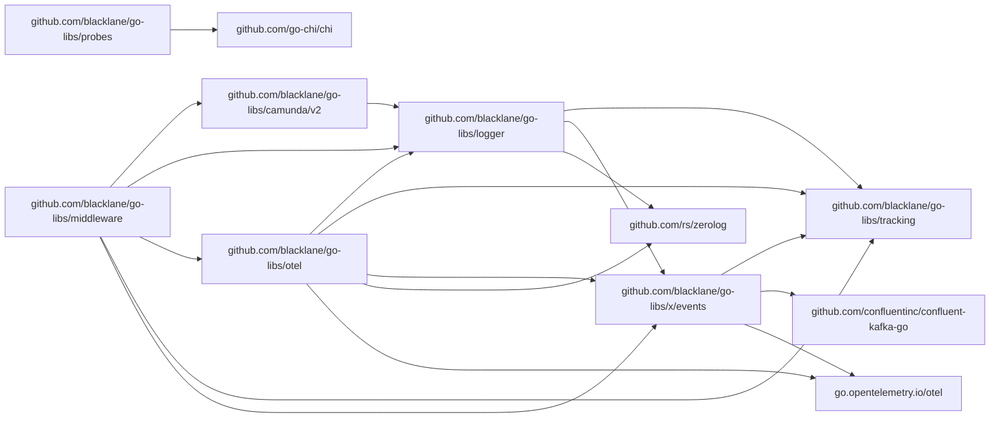

# go-libs

Blacklane's [multi-module repository](https://github.com/golang/go/wiki/Modules#faqs--multi-module-repositories) for Go libraries :)

It's a work in progress, everyone is welcome to help. We use 
[GitHub Issues](https://github.com/blacklane/go-libs/issues) for bug report and requests.

## Releasing

Follow the [Releasing Process](./RELEASING.md)

## Dependency Graph


## Makefile commands

- `tools`: download all dev tools
- `golangci-lint`: run [golangci-lint](https://golangci-lint.run/) in all modules
- **`go-mod-tidy`**: run `go mod tidy` in all modules
- `misspell`: run [misspell](https://github.com/client9/misspell) in all `*.md` files
- **`lint`**: execute `go-mod-tidy`, ` golangci-lint` and `misspell`
- `generate`: run `go generate ./...` in all modules
- `build`: run `go build ./...` in all modules
- **`test`**: run `go test ./...` in all modules, extra targets are also provided:
  - `test-race`
  - `test-bench`
  - `test-short`
  - `test-verbose`
- **`test-coverage`**: run test coverage and merge all results in a `coverage.txt` file
- `go-work-init`: initialize go workspace to help in local development
- **`prerelease`**: create prerelease branch for the provided `MODSET` (configured in [versions.yaml](./versions.yaml) file)
- **`prerelease-all`**: create a prerelease branch for every version
- **`add-tags`**: create all tags for the actual versions, a `COMMIT` can be specified
- **`push-tags`**: push tags matching the `VERSION` param to origin

 
## Repository structure

Every folder is a library, currently we have:
 - [logger](logger): a wrapper around [zerolog](https://github.com/rs/zerolog)
 and compliant with our [standards](http://handbook.int.blacklane.io/monitoring/kiev.html)
 - [tracking](tracking): adds UUID and other things to the [context](https://golang.org/pkg/context/)
 - [x](x): Experimental, they are experiments or work in progress which are not ready to be recommended
 as a standard
   - [events](https://github.com/blacklane/go-libs/tree/events/x/events): An event producer and consumer abstraction and a kafka implementation. Currently a work in progress on the branch [`events`](https://github.com/blacklane/go-libs/tree/events)

The maintainers of each library is defines in the CODEOWNERS file. If the library does not provide one,
consider the top-level [CODEOWNERS](CODEOWNERS) as the maintainers.

## Releases and versioning

As defined by [Go modules](https://github.com/golang/go/wiki/Modules) we use semantic versioning
as defined by [semver](https://semver.org/).

The tag for version 1.2.3 of module "my-repo/foo/rop" is "foo/rop/v1.2.3".

## Commit messages, Issues and Pull Requests

They should be prefixed by the affected module, e.g.:
 - `logger: release vx.y.z`
 - `tracking: add functions to read/set Gopher name in the context`


For commit messages we follow the [Go project standard](https://tip.golang.org/doc/contribute.html#commit_messages)
as much as possible.

>  A rule of thumb is that it should be written so to complete the sentence 
> "This change modifies X to _____." 
> That means it does not start with a capital letter, 
> is not a complete sentence, and actually summarizes the result of the change. 

## Requirements to download Go private modules

-  Set `GOPRIVATE=github.com/blacklane/*`.
        For details check the [docs](https://golang.org/cmd/go/#hdr-Configuration_for_downloading_non_public_code). Note that, you should avoid the [Go proxy](https://proxy.golang.org/) and [Go sum database](https://sum.golang.org/).
 - Ensure `go get` makes authenticated calls to Github.
        In order to do so, configure `git` authentication either for _HTTPS_ or _SSH_

### Configuring git authentication over HTTPS

Make `git` to use `https://$GITHUB_TOKEN@github.com/` instead of `https://github.com/`, where `GITHUB_TOKEN` is your [_personal access token_](https://docs.github.com/en/github/authenticating-to-github/creating-a-personal-access-token)

To do so run: `git config --global url.https://$GITHUB_TOKEN@github.com/.insteadOf https://github.com`

Alternatively you can manually edit your `~/.gitconfig` and add the following:

```
[url "https://YOUR_GITHUB_TOKEN@github.com/"]
	insteadOf = https://github.com/
```

This is the best option to be used when building a docker image, also `GITHUB_TOKEN` is already available on our drone

### Configuring git authentication over SSH

Make `git` to use `ssh://git@github.com/` instead of `https://github.com/`

To do so run: `git config --global url.ssh://git@github.com/.insteadOf https://github.com/`

Alternatively you can manually edit your `~/.gitconfig` and add the following:
```
[url "ssh://git@github.com/"]
	insteadOf = https://github.com/
```

This is the most common for local setup as usually git authentication over SSH is already configured.

### Troubleshooting

 - Ensure your git authentication is set up and working by cloning a private repo over HTTPS:
   `git clone https://github.com/blacklane/go-libs.git`

 - Ensure `GOPRIVATE` is set and contains `github.com/blacklane/*`:
   `go env | grep GOPRIVATE`

 - When building a docker image, ensure you pass `GITHUB_TOKEN` as a build argument:
   `[docker|docker-build] build --secret id=github_token,src=.env`
