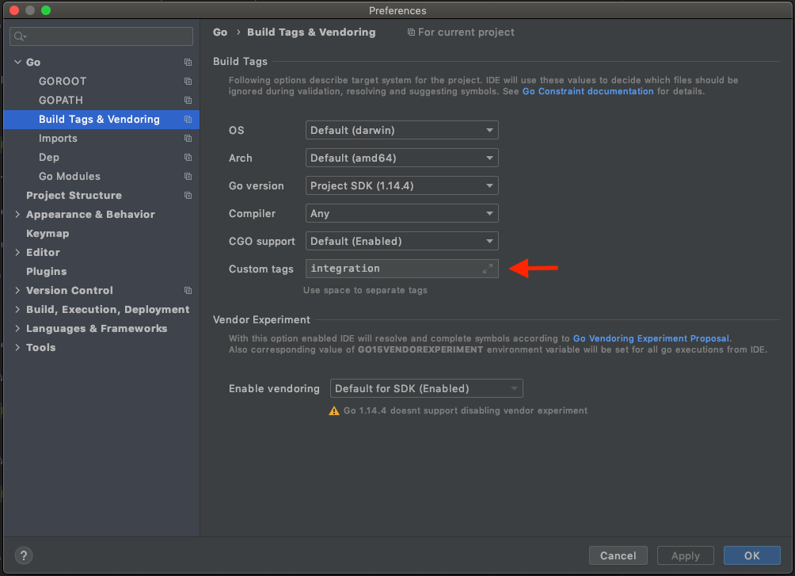

events
-----------
An event abstraction library with a Kafka implementation.

You can find examples on [examples](examples) folder.

## Usage

`go get github.com/blacklane/go-libs/x/events@events`

### Consumer

```go
	consumer, err := kafka.NewConsumer(&kafka.ConfigMap{
		"group.id":           "consumer-example" + strconv.Itoa(int(time.Now().Unix())),
		"bootstrap.servers":  "localhost:9092",
		"session.timeout.ms": 6000,
		"auto.offset.reset":  "earliest",
	})
	if err != nil {
		log.Panicf("could not create kafka consumer: %v", err)
	}

	if err := consumer.Subscribe(topic, nil); err != nil {
		log.Panicf("failed to subscribe to Kafka topic %s: %v", topic, err)
	}

	c := events.NewKafkaConsumer(consumer, events.HandlerFunc(
		func(ctx context.Context, e events.Event) error {
			log.Printf("consumed event: %s", e.Payload)
			return nil
		}))

	c.Run(time.Second)
```

### Producer

```go
	errHandler := events.ErrorHandlerFunc(func(event events.Event, err error) {
		log.Panicf("failed to deliver the event %s: %v", string(event.Payload), err)
	})

	kpc := events.NewKafkaProducerConfig(&kafka.ConfigMap{
		"bootstrap.servers":  "localhost:9092",
		"message.timeout.ms": 1000,
	})
	kpc.WithEventDeliveryErrHandler(errHandler)

	p, err := events.NewKafkaProducer(kpc)
	if err != nil {
		log.Panicf("could not create kafka producer: %v", err)
	}

	// handle failed deliveries
	_ = p.HandleEvents()
	defer p.Shutdown(context.Background())

	e := events.Event{Payload: []byte("Hello, Gophers")}
	err = p.Send(
		e,
		"events-example-topic")
	if err != nil {
		log.Panicf("error sending the event %s: %v", e, err)
	}
```

## Usage with OAuth2.0 authentication

On [examples/oauth/Makefile](examples/oauth/Makefile) you find a makefile with the
default kafka console consumer and producer configured to use OAuth2.0 authentication.
You only have to set your OAuth Client ID and Secret.  

### Consumer

```go
tokenSource := oauth.NewTokenSource(
		"FIX_ME_ClientID",
		"FIX_ME_ClientSecret",
		"FIX_ME_TokenURL",
		5*time.Second,
		http.Client{Timeout: 3 * time.Second})

	kafkaConfig := &kafka.ConfigMap{
		"group.id":           "KafkaGroupID",
		"bootstrap.servers":  "KafkaServer",
		"session.timeout.ms": 6000,
		"auto.offset.reset":  "earliest",
	}

	kc := events.NewKafkaConsumerConfig(kafkaConfig)
	kc.WithOAuth(tokenSource)
	kc.WithErrFunc(func(err error) { errLogger.Print(err) })

	log.Printf("creating kafka consumer for topic %s...", topic)
	c, err := events.NewKafkaConsumer(
		kc,
		[]string{topic},
		events.HandlerFunc(
			func(ctx context.Context, e events.Event) error {
				log.Printf("consumed event: %s", e.Payload)
				return nil
			}))
	if err != nil {
		panic(fmt.Sprintf("could not create kafka consumer: %v", err))
	}

	c.Run(time.Second)
```

### Producer

```go
	tokenSource := oauth.NewTokenSource(
		"FIX_ME_ClientID",
		"FIX_ME_ClientSecret",
		"FIX_ME_TokenURL",
		5*time.Second,
		http.Client{Timeout: 3 * time.Second})

	kpc := events.NewKafkaProducerConfig(&kafka.ConfigMap{
		"bootstrap.servers":  config.KafkaServer,
		"message.timeout.ms": 6000,
	})
	kpc.WithEventDeliveryErrHandler(errHandler)
	kpc.WithOAuth(tokenSource)
	kpc.WithErrFunc(func(err error) { errLogger.Print(err) })

	p, err := events.NewKafkaProducer(kpc)
	if err != nil {
		log.Panicf("could not create kafka producer: %v", err)
	}

	_ = p.HandleEvents()
	defer func() { log.Printf("Shutdown: %v", p.Shutdown(context.Background())) }()

	payload := fmt.Sprintf("[%s] Hello, Gophers", time.Now())
	e := events.Event{Payload: []byte(payload)}

	err = p.Send(e, topic)
	if err != nil {
		log.Printf("[ERROR] sending the event %s: %v", e, err)
	}
```

## Development

We provide a [`docker-compose`](docker-compose.yml) to spin up all the needed
dependencies and run the tests as well as `.env_local` with the needed 
environment variables. 

To spin up a kafka cluster and connect from you local machine, run:
```shell script
make compose-kafka
```
 - kafka is reachable on `localhost:9092`
 - zookeeper is reachable on `localhost:2181`

you might run `make clean` to stop and remove the containers created by docker-compose  

## Tests

 - Pass the build tag `integration` to `go test` to run integrations tests
 - Use the `-short` to skip slow tests. As some tests need to publish and 
 consume messages they sleep for a few seconds.
 - use `.env_compose` if running the tests through dockercompose

### Docker compose
```shell script
make compose-tests
```

### Local
```shell script
make test
```


## IDEs

As build tags are used to separate integration tests from unit tests make sure
to set up your IDE to include the files with the `integration` build flag 

### GoLand

To set it up to always use custom build flags:

- Go to `Preferences > Go > Build Tags & Vendoring` and fill in `Custom tags`



- Then on `Run/Debug Configurations` set `Templates > Go Test` 
to _Use all custom build tags_


